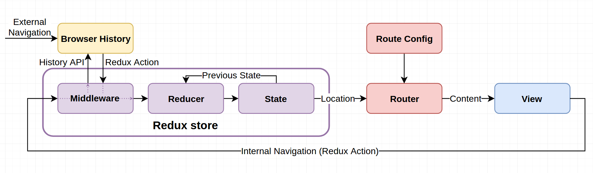
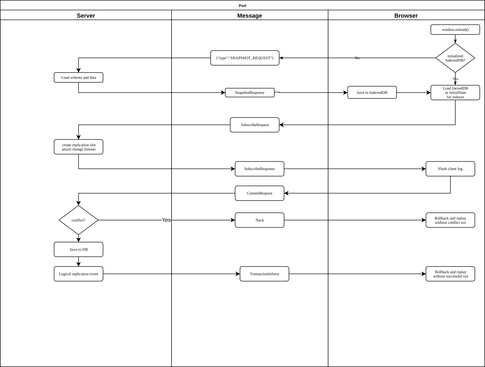

# pgrepl

pgrepl is a project that aims to use the [Logical Replication](https://jdbc.postgresql.org/documentation/head/replication.html) feature of PostGreSQL 9.4+ to bidirectionally replicate an entire database (or subsets of a database) to clients in real-time using websockets, solving the problem of caching/invalidation within SPAs.

Though this project is not dependent upon React or Redux, adoption will come most naturally to client-side developers used to thinking in a log/present-state pattern.

## Build Status


## Background

This project was inspired by [redux-first-routing](https://medium.freecodecamp.org/an-introduction-to-the-redux-first-routing-model-98926ebf53cb).

Redux is built on [3 fundamental principles](https://github.com/reactjs/redux/blob/master/docs/introduction/ThreePrinciples.md):

1. The store is the single source of truth
1. State is read-only
1. Changes are made with pure functions (reducers)

Fortunately, as Michael Sargent points out in his article, we can break the 1st principle as long as we have a provable way to keep other sources in sync:



We can also break the 3rd principle to copy changes to IndexedDB asynchronously, as long as:
 
1. Transactions arrive at IndexedDB in the same order
1. Transactions are committed to IndexedDB atomically
1. We reload the entire app if an IndexedDB transaction fails  

## Setup

1. git clone this repo
1. ./gradlew build
1. Observe passing tests

## Flow



## Protocol

Example insert:

```JSON
{
    "type": "TXN",
    "payload": {
        "xid": 1234,
        "id": "90489467-8c5d-47a4-9ebf-ac71b9d4af7d",
        "lsn": 1001,
        "changes": [
            {
                "type": "INSERT",
                "table": "person",
                "post": {
                    "id": "79cd28e5-b6e4-42a6-9da6-b605a701e1de",
                    "firstName": "Alan",
                    "lastName": "Turing",
                    "curTxnId": "90489467-8c5d-47a4-9ebf-ac71b9d4af7d"
                    "prvTxnId": undefined  
                }
            }
        ]
    }
}
```

* This insert will only succeed if there is not already an entry in the `person` table with the same ID. 

Example update:

```JSON
{
    "type": "TXN",
    "payload": {
        "xid": 1235,
        "id": "79f17574-180d-41e3-9e0f-a394e37e2846",
        "lsn": 1002,
        "changes": [
            {
                "type": "UPDATE",
                "table": "person",
                "prior": {
                    "id": "79cd28e5-b6e4-42a6-9da6-b605a701e1de",
                    "firstName": "Alan",
                    "lastName": "Turing",
                    "curTxnId": "90489467-8c5d-47a4-9ebf-ac71b9d4af7d"  
                    "prvTxnId": undefined  
                },
                "post": {
                    "id": "79cd28e5-b6e4-42a6-9da6-b605a701e1de",
                    "firstName": "Alan",
                    "lastName": "Kay",
                    "prvTxnId": "90489467-8c5d-47a4-9ebf-ac71b9d4af7d",
                    "curTxnId": "79f17574-180d-41e3-9e0f-a394e37e2846"  
                }
            }
        ]
    }
}
```

This update will only succeed if:
* There is already an entry in the `person` table with the same `id`
* The `curTxnId` of the existing row matches the `prvTxnId` of the `post` field of the `UPDATE` 

Example delete:

```JSON
{
    "type": "TXN",
    "payload": {
        "xid": 1235,
        "id": "518e2c9d-2a32-48e4-bd1b-14c81f6b9b2a",
        "lsn": 1002,
        "changes": [
            {
                "type": "DELETE",
                "table": "person",
                "prior": {
                    "id": "79cd28e5-b6e4-42a6-9da6-b605a701e1de",
                    "firstName": "Alan",
                    "lastName": "Turing",
                    "prvTxnId": "90489467-8c5d-47a4-9ebf-ac71b9d4af7d",
                    "curTxnId": "79f17574-180d-41e3-9e0f-a394e37e2846"  
                }
            }
        ]
    }
}
```

This delete will only succeed if:
* There is already an entry in the `person` table with the same `id`
* The `curTxnId` of the existing row matches the `curTxnId` of the `prior` field of the `DELETE` 
